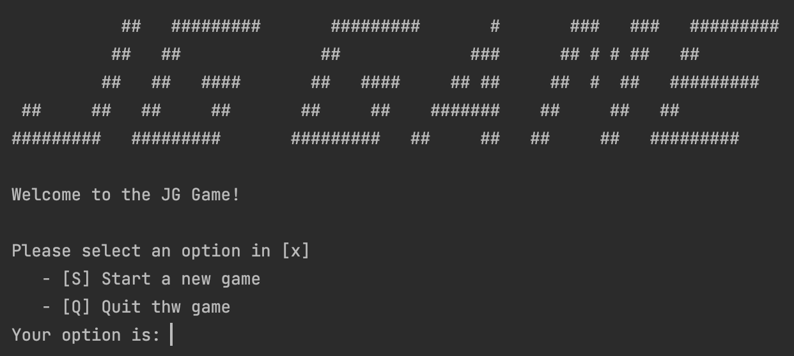
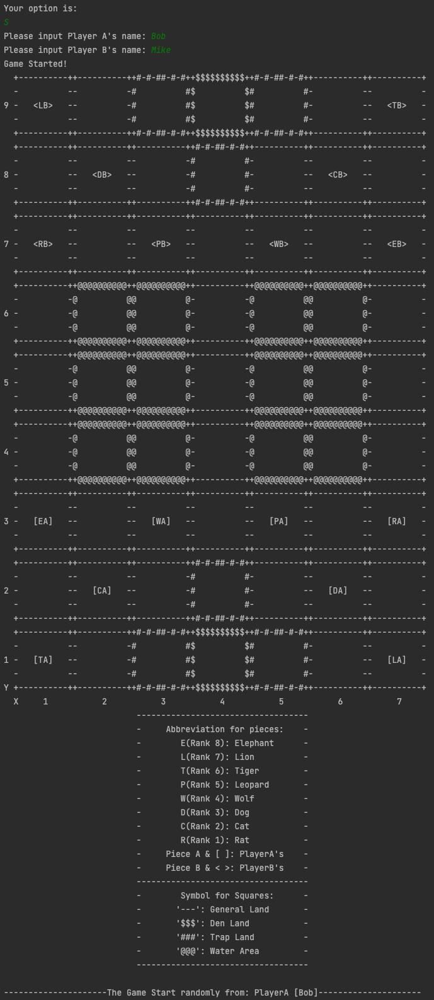
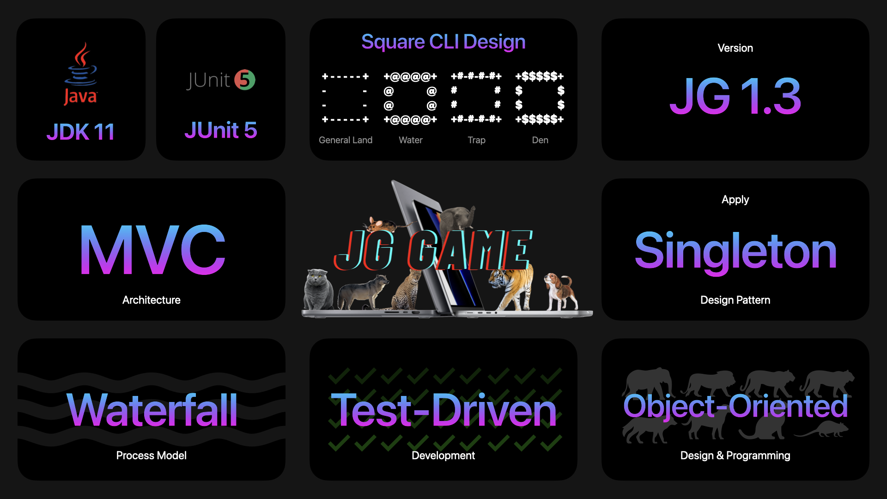

# Jungle Game Project

> *A Group Project of Software Engineering (COMP3211) subject at [The Hong Kong Polytechnic University](https://www.polyu.edu.hk/), made by [CHEN Derun](https://github.com/ShanpooO), [JIANG Yiyang](https://github.com/fletcherjiang), and [ZHANG Wengyu](https://github.com/zhangwengyu999), 2022-11-18* 

## Group Members

- [CHEN Derun](https://github.com/ShanpooO) 
- [JIANG Yiyang](https://github.com/fletcherjiang)
- [ZHANG Wengyu](https://github.com/zhangwengyu999)

---

</img>  
</img>

---

## Features

</img>

For detailed features, please refer to [Software Requirements Specification](https://github.com/ShanpooO/Jungle_Game_Project/blob/main/Software_Requirements_Specification.pdf).

---

## Developer & User Manual

For detailed developer manual, please refer to [Developer Manual](https://github.com/ShanpooO/Jungle_Game_Project/blob/main/Developer_Manual.pdf).

For detailed user manual, please refer to [User Manual](https://github.com/ShanpooO/Jungle_Game_Project/blob/main/User_Manual.pdf).

---

Copyright © [CHEN Derun](https://github.com/ShanpooO), [JIANG Yiyang](https://github.com/fletcherjiang), and [ZHANG Wengyu](https://github.com/zhangwengyu999) at [The Hong Kong Polytechnic University](https://www.polyu.edu.hk/). All rights reserved.

